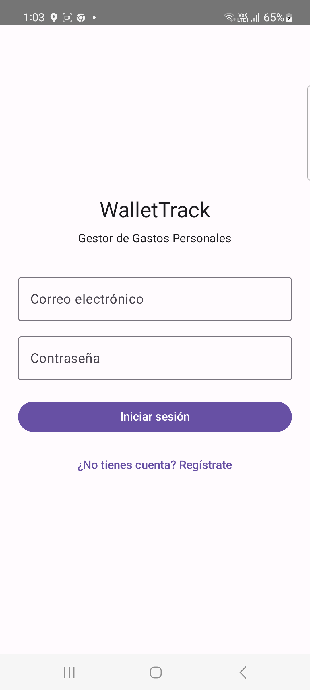
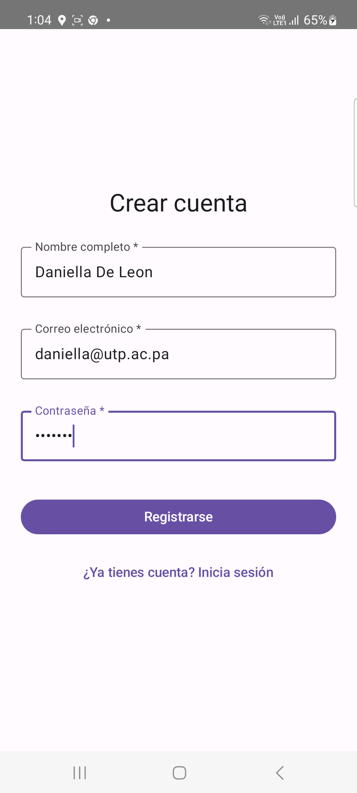
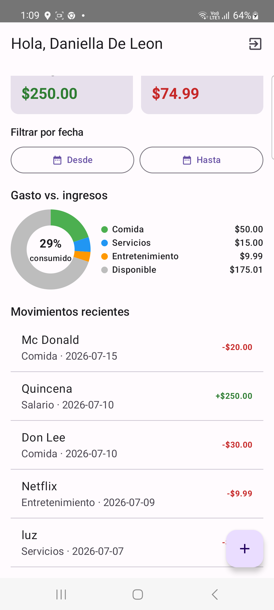
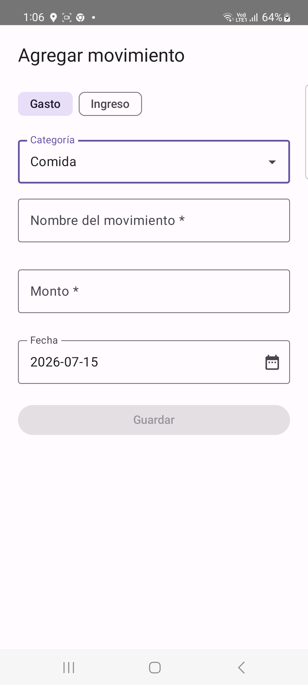

# WalletTrack — Gestor de Gastos Personales

Proyecto final de Ingeniería de Software.

## Integrantes

| Integrante        | Cargo                         |
|-------------------|--------------------------------|
| Danna Dawkins      | Scrum Master                   |
| Juan Botacio        | Backend Developer               |
| Luz De Leon         | Frontend / Android Developer    |
| Daniella De Leon    | Fullstack Developer             |
| María Quiñones      | Product Owner                   |
| Abigail Koo         | QA / DevOps                     |

## Descripción
App Android (Kotlin + Jetpack Compose) para registrar y visualizar gastos e
ingresos personales, con autenticación JWT, dashboard con gráficos y uso del
acelerómetro (shake para agregar un gasto rápido).

## Estructura del repositorio
```
GestorGastosApp/
├── android/   -> Proyecto de Android Studio (Kotlin, Compose, Retrofit)
└── api/       -> API REST (Node.js + Express + JWT + SQLite)
```

## Cómo correr el API
```bash
cd api
npm install
npm start
```
El API queda disponible en `http://localhost:3000`.
Endpoints principales: `/api/auth/register`, `/api/auth/login`,
`/api/expenses` (GET/POST/PUT/PATCH/DELETE), `/api/expenses/summary`.

## Cómo correr la app Android
1. Abrir la carpeta `android/` con Android Studio.
2. Si usas el **emulador**, la URL `http://10.0.2.2:3000/` en
   `app/build.gradle.kts` (`BASE_URL`) ya apunta al API corriendo en tu PC.
3. Si usas un **dispositivo físico** conectado por hotspot/red local, cambia
   `BASE_URL` por la IP de tu computadora en esa red, ej.
   `http://192.168.1.10:3000/`. Para producción, despliega el API en
   Render/Railway y usa esa URL pública.
4. Ejecutar la app (Run ▶) con el API corriendo.

## Sensor utilizado
Acelerómetro (`ShakeDetector.kt`): al agitar el teléfono en el Dashboard, se
abre automáticamente la pantalla de "Agregar gasto".

## Capturas de pantalla
> Reemplaza cada línea de abajo subiendo tu imagen a `screenshots/` y
> ajustando el nombre del archivo (o arrastra la imagen directo en el editor
> de este README en GitHub para que te genere el link automáticamente).

| Login | Registro |
|---|---|
|  |  |

| Dashboard | Agregar gasto |
|---|---|
|  |  |

## Video demo
[Ver demo en video](screenshots/demo.mp4) *(sube el archivo a `screenshots/` o pega aquí el link de YouTube/Drive)*

Ver el documento **WalletTrack_Plan_de_Proyecto.docx** para el plan de proyecto
completo (objetivo, caso de negocio, arquitectura, base de datos, cronograma,
riesgos y anexo técnico).
